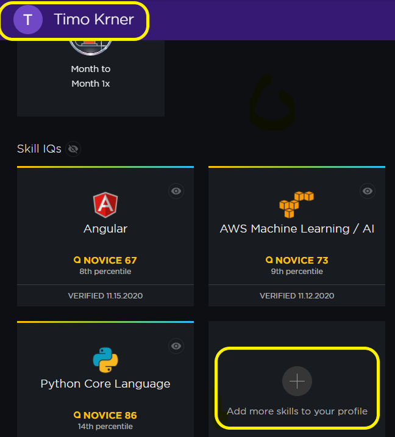
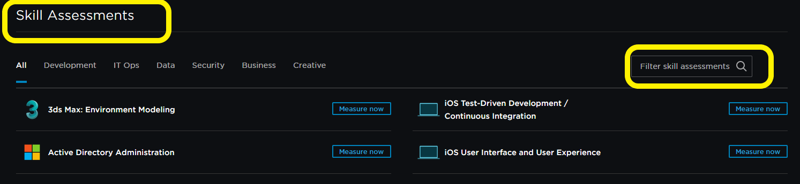

<!-- markdownlint-disable -->
<!-- ALL-CONTRIBUTORS-BADGE:START - Do not remove or modify this section -->

<!-- ALL-CONTRIBUTORS-BADGE:END -->
## Pluralsight-quiz-questions

> This repository does not pretend to give you all answers for **Pluralsight questions**, rather it's a starting guide to help you prepare for the skills quiz and to know what to expect. 

&nbsp;
### Table of Contents

| Quiz      |  Status |
| --------- |  ------ |
| [Angular](angular.md) | ok |
| [AngularJs](angularjs.md) | ok |
| [Aws Big Data](aws_big_data.md) | ok |

  &nbsp;

## Getting Started

How do I create a free **Pluralsight Account** and do a test?
- [Signup](https://app.pluralsight.com) and get an account
- In your profile (top right on dashboard) click on **+ Add more skills to your profile** (see image 1)
- You should now be on the [SkillIQ site](https://app.pluralsight.com/skilliq)
- Enter a Search Name for the skill assessments on the right, like **IOS TDD** or **React**(Image 2)
- Select one and Start the test (**Show off!**)

&nbsp;

Image 1

&nbsp;
&nbsp;

Image 2

&nbsp;
&nbsp;

Should you have found some incorrect answers, or want to contribute your answers in a md file, please feel free to create a PR.  

&nbsp;
  
  &nbsp;

## Contributors ✨

  &nbsp;

Thanks goes to these wonderful people ([emoji key](https://allcontributors.org/docs/en/emoji-key)):

<!-- ALL-CONTRIBUTORS-LIST:START - Do not remove or modify this section -->
<!-- prettier-ignore-start -->
<!-- markdownlint-disable -->

  &nbsp;

<table>
  <tr>
    <td align="center"><a href="http://tik9.github.io/cv"> <b>Timo Körner</b></a> <a href="#business-tik9" title="Business development">💼</a> <a href="https://github.com/tik9/pluralsight-skill-test/commits?author=tik9" title="Code">💻</a></td>
  </tr>
</table>

<!-- markdownlint-enable -->
<!-- prettier-ignore-end -->
<!-- ALL-CONTRIBUTORS-LIST:END -->

  &nbsp;

This project follows the [all-contributors](https://github.com/all-contributors/all-contributors) specification. Sensible contributions via **PR** welcome!

  &nbsp;

## Going further
  &nbsp;

- [Getting Started](https://github.com/tik9/tesseractToMarkdown) with Tesseract and Python
- [**More** Skill tests not related to Pluralsight](https://github.com/tik9/further-skill-tests)
